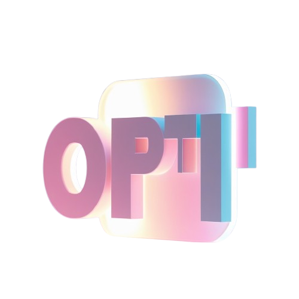

# 🚀 OptiFi

OptiFi simplifies decentralized finance (DeFi) by leveraging AI or DeFAI, smart contracts, and an innovative Agent Wallet system managed by AI to automate portfolio management and optimize returns.

---

## 🔥 How It Works

### 1️⃣ Wallet Connection 🔌
The process begins when a user connects their crypto wallet (e.g., MetaMask, WalletConnect) to the OptiFi platform. This secure connection allows the platform to interact with the user’s assets while maintaining full control of private keys within the user’s primary wallet.

### 2️⃣ Agent Wallet Generation 🤖
Upon connecting their wallet, users generate an **Agent Wallet**, which is uniquely tied to their primary wallet. This **Agent Wallet** serves as the foundation for automation within the platform:

- Executes transactions on behalf of the user, such as signing and rebalancing portfolios automatically.
- Each user can only have **one Agent Wallet**, ensuring transparency and preventing misuse.
- Eliminates manual approvals for staking, swapping, and rebalancing.
- Uses **MPC (Multi-Party Computation) technology via the Coinbase SDK** for secure and trustless transaction signing, maintaining full control of private keys.

### 3️⃣ Risk Profiling Questionnaire 📝
Users complete a questionnaire to assess their risk tolerance and financial goals. Based on responses, the platform categorizes users into one of three risk profiles:

- 🟢 **Conservative:** Stablecoin-focused strategies prioritizing capital preservation.
- 🟡 **Balanced:** A mix of stablecoins and top-tier cryptocurrencies.
- 🔴 **Aggressive:** High-yield, speculative asset strategies.

### 4️⃣ AI-Driven Risk Analysis 🎯
Using advanced AI algorithms, OptiFi analyzes the questionnaire responses and assigns a risk category: **Low, Medium, or High.**

#### Recommended Asset Allocation:
- 🟢 **Conservative:** Stablecoins (e.g., USDC, USDT, DAI) in low-risk protocols like **Compound, AAVE, Curve Finance**.
- 🟡 **Balanced:** 50% stablecoins, 50% top-tier cryptos (BTC, ETH, SOL, BNB), targeting high APY opportunities.
- 🔴 **Aggressive:** High APY protocols with speculative coins and volatile assets.

> ⚠️ **For hackathon development:** Fund allocation is subject to change based on protocol integrations and market conditions.

### 5️⃣ Token Staking via Agent Wallet 💰
- Tokens required for the chosen strategy are **staked automatically** through the **Agent Wallet**.
- If the user doesn’t have the required tokens, they can be **swapped** within the platform.
- Tokens are transferred to the **Agent Wallet**, which stakes them in DeFi protocols seamlessly.

### 6️⃣ Portfolio Monitoring and Withdrawals 📊
Users can track investments via the **Dashboard**, displaying:
- 💰 **Total Investment Amount**
- 📈 **Profit and Loss Metrics**
- 📊 **Asset Allocation Breakdown**
- 🔄 **Transaction History**
- ✅ **Withdrawals:** Funds are returned to the user’s primary wallet anytime they choose to liquidate their position.

### 7️⃣ Dynamic Rebalancing ⚖️
OptiFi dynamically rebalances portfolios using **real-time market data**, ensuring optimal risk-adjusted returns:

- 🔵 **During volatility:** AI may shift assets to **lower-risk strategies** for capital preservation.
- 🟠 **When high-yield opportunities arise:** AI reallocates funds to maximize APY while staying within the user’s risk tolerance.

This ensures that portfolios are always **optimized for maximum yield** while aligning with financial goals.

---

## ⚙️ Hackathon Implementation Notes
- 🔐 **Agent Wallet Keys:** Stored on a local **VPS server** (pending OPSEC implementation).
- 🪙 **Mock Tokens:** Used to simulate transactions and interactions within the platform.

---

## 📜 License
This project is licensed under the MIT License.

---

## ✅ Website URL
🌐 Website: [https://originx.vercel.app/](https://opti-finance.vercel.app/)  

---

🔥 **Empowering DeFi with AI & Automation!** 🚀